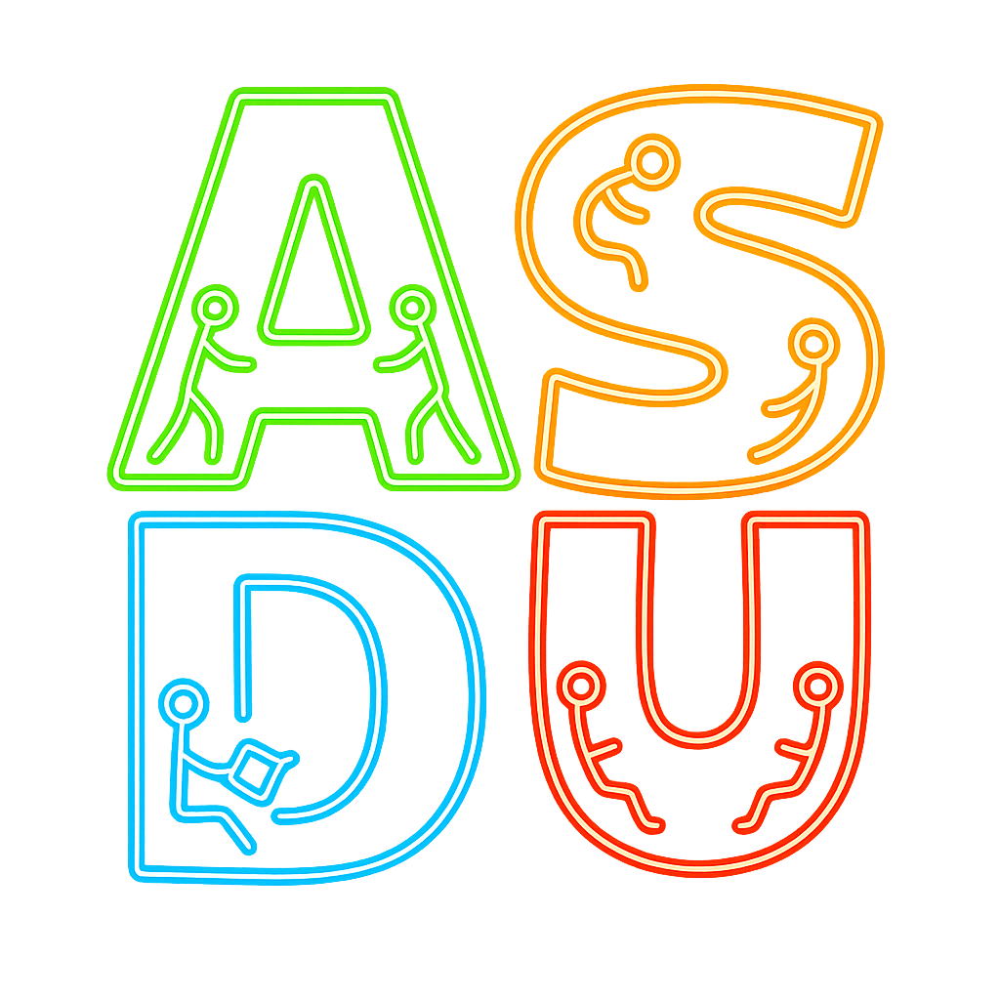

	

	<!-- Tarjeta del logo (simple y compatible con GitHub) -->
		

			

				
			

		

	

	
	
	

---

## ¿Qué es ASDU?

Somos un círculo de estudios donde aprendemos haciendo: pequeños retos, talleres prácticos, y proyectos colaborativos en tecnologías de software, datos, IA y cloud. Nuestro foco es que te lleves algo útil y publicable en cada sesión.

### Lo que hacemos
- Talleres prácticos y katas técnicas con mentores de la comunidad.
- Proyectos open-source guiados (desde idea hasta deploy).
- Reading groups y discusiones de papers/blogs.
- Charlas relámpago (lightning talks) y demos.

---

## Áreas de estudio

- Web y APIs (JavaScript/TypeScript, React, Node.js)
- Datos y BI (Python, SQL, Pandas, Power BI)
- IA/ML (scikit-learn, PyTorch/TensorFlow, MLOps)
- DevOps y Cloud (Docker, Kubernetes, CI/CD, AWS/Azure/GCP)

	
	
	
	
	
	
	

---

## Cómo participar

1) Explora los repos de la organización y mira los issues etiquetados como `good first issue` o `help wanted`.

2) Únete a una sesión de estudio: practicamos en vivo con problemas reales y code reviews.

3) Propón un tema o proyecto: abre un issue en el repo correspondiente y cuéntanos el objetivo y alcance.

4) Comparte tu demo o aprendizaje: un gist, un PR o una mini charla.

> No necesitas permiso para empezar. Haz un fork, crea una rama y envía tu PR. ¡Te ayudamos en el camino!

---

## Repositorios y proyectos destacados

	

	

	

		🗂️ Noticias_Tech_ASDU — noticias y tendencias tecnológicas
			
				
				
		
	

	

		
	

	

		
		
		
		
	

	

		
	

	

		
	

	

		📅 schedule-project — planificación de sesiones
			
				
				
		
	

	

		
	

	

		
		
		
		
	

	

		
	

	

		
	

	

		🌐 New-Web-Page-ASDU — nueva web de la comunidad
			
				
				
				
		
	

	

		
	

	

		
		
		
		
	

	

		
	

	

		
	

	
	
	

<!-- sección de logros eliminada a petición -->

## Recursos útiles

- Guía de Markdown en GitHub: https://docs.github.com/es/markdown
- Flujo de trabajo con Pull Requests: https://docs.github.com/es/pull-requests
- Buenas prácticas de issues: https://docs.github.com/es/issues/tracking-your-work-with-issues/about-issues

- Guía de contribución: ./../CONTRIBUTING.md
- Código de conducta: ./../CODE_OF_CONDUCT.md

---

	<!-- Separador tipo ola -->
	<svg width="100%" height="90" viewBox="0 0 1200 90" xmlns="http://www.w3.org/2000/svg" preserveAspectRatio="none" role="img" aria-label="decorative wave">
		<path d="M0,60 C150,20 350,20 500,60 C650,100 850,100 1000,60 C1100,30 1150,30 1200,60 L1200,90 L0,90 Z" fill="#36BCF7" fill-opacity="0.15"></path>
		<path d="M0,70 C200,40 300,40 500,70 C700,100 900,100 1200,70 L1200,90 L0,90 Z" fill="#36BCF7" fill-opacity="0.10"></path>
		<path d="M0,80 C250,60 350,60 600,80 C850,100 950,100 1200,80 L1200,90 L0,90 Z" fill="#36BCF7" fill-opacity="0.08"></path>
	</svg>
	 
	Hecho con ❤️ por la comunidad <strong>ASDU</strong>. ¿Ideas? Abre un issue y conversemos.

