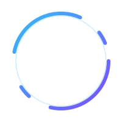

	

	<!-- Tarjeta del logo con borde, radio y sombra sutil -->
		

			

			<!-- Anillo animado debajo -->
				
			<!-- Logo original encima -->
				<!-- Logo con glow amarillo y latido suave usando filtro SVG -->
				<svg width="136" height="136" viewBox="0 0 136 136" style="position:absolute; top:50%; left:50%; transform:translate(-50%, -50%); z-index:2;">
					<defs>
						<filter id="pulseGlow" x="-40%" y="-40%" width="180%" height="180%">
							<!-- sombra sutil para relieve -->
							<feDropShadow dx="0" dy="1" stdDeviation="0.7" flood-color="#000000" flood-opacity="0.32" result="shadow"/>
							<!-- blur del alfa del logo -->
							<feGaussianBlur in="SourceAlpha" stdDeviation="2" result="blur">
								<animate attributeName="stdDeviation" values="2;3.2;2" dur="3s" repeatCount="indefinite"/>
							</feGaussianBlur>
							<!-- color amarillo aplicado al blur -->
							<feFlood flood-color="#FACC15" flood-opacity="0.22" result="flood">
								<animate attributeName="flood-opacity" values="0.18;0.30;0.18" dur="3s" repeatCount="indefinite"/>
							</feFlood>
							<feComposite in="flood" in2="blur" operator="in" result="coloredBlur"/>
							<!-- mezcla: sombra + glow + original -->
							<feMerge>
								<feMergeNode in="shadow"/>
								<feMergeNode in="coloredBlur"/>
								<feMergeNode in="SourceGraphic"/>
							</feMerge>
						</filter>
					</defs>
					<image href="../public/img/asdunewlogo.png" x="0" y="0" width="136" height="136" style="image-rendering:auto;" filter="url(#pulseGlow)"/>
				</svg>
		

	

	

	
	
	

---

## ¿Qué es ASDU?

Somos un círculo de estudios donde aprendemos haciendo: pequeños retos, talleres prácticos, y proyectos colaborativos en tecnologías de software, datos, IA y cloud. Nuestro foco es que te lleves algo útil y publicable en cada sesión.

### Lo que hacemos
- Talleres prácticos y katas técnicas con mentores de la comunidad.
- Proyectos open-source guiados (desde idea hasta deploy).
- Reading groups y discusiones de papers/blogs.
- Charlas relámpago (lightning talks) y demos.

---

## Áreas de estudio

- Web y APIs (JavaScript/TypeScript, React, Node.js)
- Datos y BI (Python, SQL, Pandas, Power BI)
- IA/ML (scikit-learn, PyTorch/TensorFlow, MLOps)
- DevOps y Cloud (Docker, Kubernetes, CI/CD, AWS/Azure/GCP)

	
	
	
	
	
	
	

---

## Cómo participar

1) Explora los repos de la organización y mira los issues etiquetados como `good first issue` o `help wanted`.

2) Únete a una sesión de estudio: practicamos en vivo con problemas reales y code reviews.

3) Propón un tema o proyecto: abre un issue en el repo correspondiente y cuéntanos el objetivo y alcance.

4) Comparte tu demo o aprendizaje: un gist, un PR o una mini charla.

> No necesitas permiso para empezar. Haz un fork, crea una rama y envía tu PR. ¡Te ayudamos en el camino!

---

## Repositorios y proyectos destacados

	

	

	

		🗂️ Noticias_Tech_ASDU — noticias y tendencias tecnológicas
			
				
				
		
	

	

		<a href="https://github.com/ASDU0/Noticias_Tech_ASDU" title="Noticias_Tech_ASDU" style="display:block;">
			<svg viewBox="0 0 420 236.25" width="100%" role="img" aria-label="OG Noticias_Tech_ASDU con marco" xmlns="http://www.w3.org/2000/svg">
				<defs>
					<linearGradient id="g1" x1="0%" y1="0%" x2="100%" y2="0%">
						<stop offset="0%" stop-color="#36BCF7"/>
						<stop offset="50%" stop-color="#7C4DFF"/>
						<stop offset="100%" stop-color="#36BCF7"/>
					</linearGradient>
					<clipPath id="clip1">
						<rect x="6" y="6" width="408" height="224.25" rx="14" ry="14"/>
					</clipPath>
					<filter id="glow1" x="-20%" y="-20%" width="140%" height="140%">
						<feDropShadow dx="0" dy="4" stdDeviation="6" flood-color="#36BCF7" flood-opacity="0.35"/>
					</filter>
					<filter id="glow1soft" x="-20%" y="-20%" width="140%" height="140%">
						<feDropShadow dx="0" dy="0" stdDeviation="4" flood-color="#7C4DFF" flood-opacity="0.35"/>
					</filter>
					
				</defs>
				<rect x="1.5" y="1.5" width="417" height="233.25" rx="16" ry="16" fill="rgba(0,0,0,0.15)" stroke="url(#g1)" stroke-width="2.5" stroke-dasharray="12 8" class="frame"/>
				<image href="https://opengraph.githubassets.com/1/ASDU0/Noticias_Tech_ASDU" x="6" y="6" width="408" height="224.25" clip-path="url(#clip1)" class="preview"/>
				<rect x="6" y="6" width="408" height="224.25" rx="14" ry="14" fill="none" stroke="url(#g1)" stroke-width="1.2" class="frame"/>
			</svg>
		</a>
	

	

		
		
		
		
	

	

		
	

	

		
	

	

		📅 schedule-project — planificación de sesiones
			
				
				
		
	

	

		<a href="https://github.com/ASDU0/schedule-project" title="schedule-project" style="display:block;">
			<svg viewBox="0 0 420 236.25" width="100%" role="img" aria-label="OG schedule-project con marco" xmlns="http://www.w3.org/2000/svg">
				<defs>
					<linearGradient id="g2" x1="0%" y1="0%" x2="100%" y2="0%">
						<stop offset="0%" stop-color="#36BCF7"/>
						<stop offset="50%" stop-color="#7C4DFF"/>
						<stop offset="100%" stop-color="#36BCF7"/>
					</linearGradient>
					<clipPath id="clip2">
						<rect x="6" y="6" width="408" height="224.25" rx="14" ry="14"/>
					</clipPath>
					<filter id="glow2" x="-20%" y="-20%" width="140%" height="140%">
						<feDropShadow dx="0" dy="4" stdDeviation="6" flood-color="#36BCF7" flood-opacity="0.35"/>
					</filter>
					<filter id="glow2soft" x="-20%" y="-20%" width="140%" height="140%">
						<feDropShadow dx="0" dy="0" stdDeviation="4" flood-color="#7C4DFF" flood-opacity="0.35"/>
					</filter>
					
				</defs>
				<rect x="1.5" y="1.5" width="417" height="233.25" rx="16" ry="16" fill="rgba(0,0,0,0.15)" stroke="url(#g2)" stroke-width="2.5" stroke-dasharray="12 8" class="frame"/>
				<image href="https://opengraph.githubassets.com/1/ASDU0/schedule-project" x="6" y="6" width="408" height="224.25" clip-path="url(#clip2)" class="preview"/>
				<rect x="6" y="6" width="408" height="224.25" rx="14" ry="14" fill="none" stroke="url(#g2)" stroke-width="1.2" class="frame"/>
			</svg>
		</a>
	

	

		
		
		
		
	

	

		
	

	

		
	

	

		🌐 New-Web-Page-ASDU — nueva web de la comunidad
			
				
				
				
		
	

	

		<a href="https://github.com/ASDU0/New-Web-Page-ASDU" title="New-Web-Page-ASDU" style="display:block;">
			<svg viewBox="0 0 420 236.25" width="100%" role="img" aria-label="OG New-Web-Page-ASDU con marco" xmlns="http://www.w3.org/2000/svg">
				<defs>
					<linearGradient id="g3" x1="0%" y1="0%" x2="100%" y2="0%">
						<stop offset="0%" stop-color="#36BCF7"/>
						<stop offset="50%" stop-color="#7C4DFF"/>
						<stop offset="100%" stop-color="#36BCF7"/>
					</linearGradient>
					<clipPath id="clip3">
						<rect x="6" y="6" width="408" height="224.25" rx="14" ry="14"/>
					</clipPath>
					<filter id="glow3" x="-20%" y="-20%" width="140%" height="140%">
						<feDropShadow dx="0" dy="4" stdDeviation="6" flood-color="#36BCF7" flood-opacity="0.35"/>
					</filter>
					<filter id="glow3soft" x="-20%" y="-20%" width="140%" height="140%">
						<feDropShadow dx="0" dy="0" stdDeviation="4" flood-color="#7C4DFF" flood-opacity="0.35"/>
					</filter>
					
				</defs>
				<rect x="1.5" y="1.5" width="417" height="233.25" rx="16" ry="16" fill="rgba(0,0,0,0.15)" stroke="url(#g3)" stroke-width="2.5" stroke-dasharray="12 8" class="frame"/>
				<image href="https://opengraph.githubassets.com/1/ASDU0/New-Web-Page-ASDU" x="6" y="6" width="408" height="224.25" clip-path="url(#clip3)" class="preview"/>
				<rect x="6" y="6" width="408" height="224.25" rx="14" ry="14" fill="none" stroke="url(#g3)" stroke-width="1.2" class="frame"/>
			</svg>
		</a>
	

	

		
		
		
		
	

	

		
	

	

		
	

	
	
	

<!-- sección de logros eliminada a petición -->

## Recursos útiles

- Guía de Markdown en GitHub: https://docs.github.com/es/markdown
- Flujo de trabajo con Pull Requests: https://docs.github.com/es/pull-requests
- Buenas prácticas de issues: https://docs.github.com/es/issues/tracking-your-work-with-issues/about-issues

- Guía de contribución: ./../CONTRIBUTING.md
- Código de conducta: ./../CODE_OF_CONDUCT.md

---

	<!-- Separador tipo ola -->
	<svg width="100%" height="90" viewBox="0 0 1200 90" xmlns="http://www.w3.org/2000/svg" preserveAspectRatio="none" role="img" aria-label="decorative wave">
		<path d="M0,60 C150,20 350,20 500,60 C650,100 850,100 1000,60 C1100,30 1150,30 1200,60 L1200,90 L0,90 Z" fill="#36BCF7" fill-opacity="0.15"></path>
		<path d="M0,70 C200,40 300,40 500,70 C700,100 900,100 1200,70 L1200,90 L0,90 Z" fill="#36BCF7" fill-opacity="0.10"></path>
		<path d="M0,80 C250,60 350,60 600,80 C850,100 950,100 1200,80 L1200,90 L0,90 Z" fill="#36BCF7" fill-opacity="0.08"></path>
	</svg>
	 
	Hecho con ❤️ por la comunidad <strong>ASDU</strong>. ¿Ideas? Abre un issue y conversemos.

